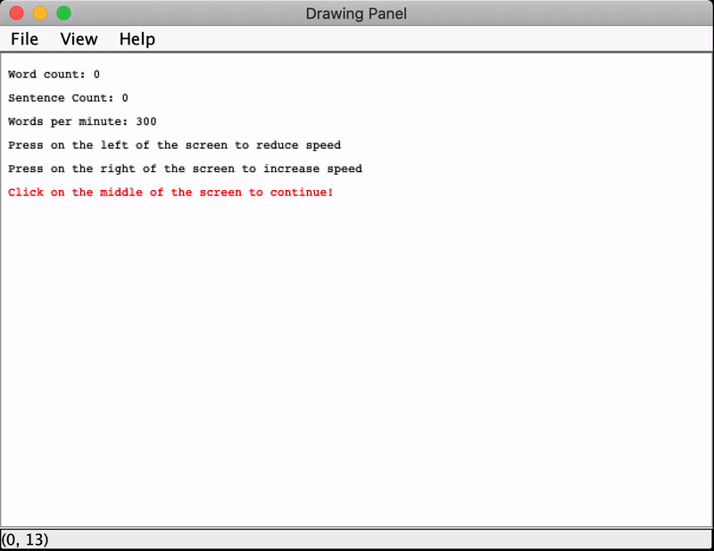

# Speed Reading Experiment using Rapid Serial Visual Presentation (RSVP)
Using Java, we implement a RSVP program with adjustable word per minute (wpm) speed and test its effectiveness using a set of reading comprehension questions. In RSVP, each word from the input text will be flashed on to the screen for a short amount of time. This technique potentially increase user's reading speed, but might affect the reading comprehension ability. 

Our program takes **.txt** and an initial reading speed (wpm). 

# Control reading speed:
- Start/Pause/Continue: click in the middle of the app's window.
- Increase reading speed (by 20 wpm): click on the right of the app's window.
- Decrease reading speed (by 20 wpm): click on the left of the app's window.

# Demo

# How to run?
The **main** function is in src/SpeedReader/SpeedReader.java. The program take 5 arguments:
1. The name of the input text file, put in same directory of src folder.
2. The width of the app's window. (recommend 600)
3. The height of the app's window. (recommend 400)
4. The font size. (recommend 44)
5. The reading speed (wpm) (recommned 300)

# Contributors: 
- Will Henderson: henderso@grinnell.edu
- Quang Nguyen: nguyenqu2@grinnell.edu
